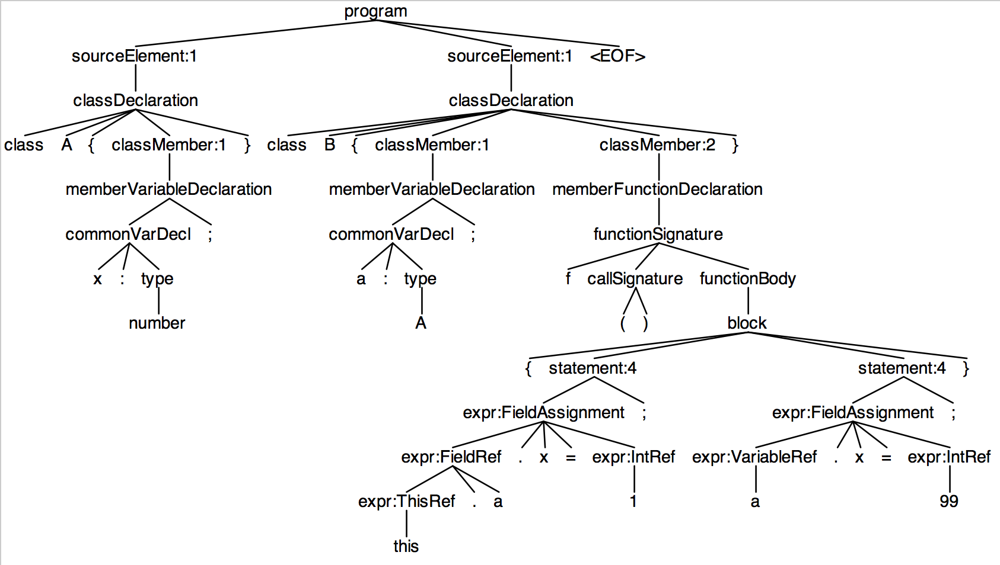

# Building a grammar and symbol table for a TypeScript subset

## Goal

Your goal is to build a grammar and symbol table for a subset of [TypeScript](http://www.typescriptlang.org/) (JavaScript with static types) The symbol table will have classes, functions, and variable definitions. Then you will make another pass over the parse tree and identify references to symbols.

## Discussion

There are three primary pieces: a grammar, a definition phase that walks the parse tree, and a type computation phase. As an example, consider [class-inherit.ts](https://github.com/USF-CS345-starterkits/parrt-symtab/blob/master/resources/samples/class-inherit.ts):

```TypeScript
class Animal {
	name : string;
}

class Horse extends Animal {
}

class Dog extends Animal {
	breed : string ;
}
```

Your grammar should result in a parse tree that looks something like the following (truncated) tree.

<center>

</center>

Your definition phase will emit output according to [class-inherit.defs](https://github.com/USF-CS345-starterkits/parrt-symtab/blob/master/resources/samples/class-inherit.defs):

```
global
    Animal
        <Animal.name:string>
    Horse
    Dog
        <Dog.breed:string>
```

Notice that the field types are known at the definition site during this first phase *because we do not allow forward references*. It is the type of expressions that we compute in the next phase. We know what the type of declarations are because they are explicitly (and statically) typed.

Your type computation phase will walk the parse tree again, setting the current scope as it descends by picking up the scope variable from the parse tree annotations. Let's take a look at another input example, [nested-field.ts](https://github.com/USF-CS345-starterkits/parrt-symtab/blob/master/resources/samples/nested-field.ts):

```TypeScript
class A {
	x : number;
}
class B {
	a : A;
	f() {
		this.a.x = 1;
		a.x = 99;
	}
}
```

For each expression, such as the left and right hand side of assignments, the type computation phase must compute and annotate the tree with type information. The [expected output](https://github.com/USF-CS345-starterkits/parrt-symtab/blob/master/resources/samples/nested-field.types) identifies the type for each component of the expressions:

```
1 is number
this is B
this.a is A
this.a.x is number
99 is number
a is A
a.x is number
```

Your type of computation phase should analyze the right-hand side of an expression before the left-hand side, as you can see from the example.

**You will use ANTLR's [antlr/symtab](https://github.com/antlr/symtab) symbol table library** to make your lives easier.

### TypeScript grammar

You must create a grammar by examining the [examples provided for unit testing](https://github.com/USF-CS345-starterkits/parrt-symtab/tree/master/samples) and using the typescript grammar(s) you find around on the net, either for ANTLR or from the [language specification](http://www.typescriptlang.org/Content/TypeScript%20Language%20Specification.pdf). Your grammar must recognize all of the sample input but should not recognize more than those structures. In other words, your grammar should recognize a strict subset of TypeScript. You cannot just dump in a full TypeScript grammar you find on the net. It must be tight to match only the structures in the samples. My solution has 70 lines.

**You are specifically allowed to copy and paste from any existing grammar you find on the net as long as you attribute where you got it from. You may not copy from fellow students!**

This part of the project is deliberately ill-specified so that you can learn how to abstract a grammar from exemplars. Please note that the decisions you make about the grammar rule names and various structures, affect the parse tree listeners used in the next two phases.

So that we can annotate the parse tree with `Scope` pointers, we will add `returns` clauses to rules in the grammar that represent simple table scopes. You can see that I have done that for the global scope in [TypeScript.g4](https://github.com/USF-CS345-starterkits/parrt-symtab/blob/master/grammars/cs345/typescript/TypeScript.g4):

```
program returns [Scope scope] : sourceElement* EOF ;
```

The parse tree node for `program` will have a `scope` field that you can set with `ctx.scope = ...;` from within a listener method where `ctx` is the listener method argument. Once you set this in the definitions phase, the references phase can set the current scope according to the value of that field.  For more information on this approach see the callout box in the ANTLR 4 reference manual called "Adding fields to nodes via rule arguments and return values."

For the type computation phase, the parse tree for expressions should be annotated with a type pointer. For example, here's what my expression rule looks like:

```
expr returns [Type etype]
	:	...
	;
```

Expressions are identifiers, `this`, integers, string literals, function calls with argument lists, field references *expr*`.x`, field assignment, and regular assignment to identifier.

Statements are blocks of code nested in curly braces, variable declarations, function declarations, or expressions followed by a semicolon.

Your grammar should support both the line and block comments.

To help you out, here is what my parse tree looks like for nested-field.ts:



### Defining symbols and scopes

As a reference, please see pattern 19: "Symbol table for classes" in the Language Implementation Patterns book.

Here are the operations to perform:

|Upon|Action(s)|
|----|---------|
program entry| create and push a global scope
program exit | pop scope
`class T` | create and define a class symbol, set ctx.scope, push scope
`class T extends U` | Same as `class T` but set superclass to `U`
exit class | pop scope
method entry | define method with return type, set `ctx.scope`, push scope
method exit | pop scope
enter block | push local scope, set `ctx.scope`
 exit block | pop scope
def field x | define field symbol in current scope, set type
def variable x | define variable symbol in current scope, set type
def parameter x | define variable symbol in current scope, set type

One of the key ideas is to maintain a `currentScope` field within the listener object.

###  Type computation

In the definition phase, you have created all of the necessary scopes, annotated the parse tree with them, and defined all of the symbols (and their explicit types). Now, we want to know the type of every expression.  To do this, we will use a visitor so that we can get return values and directly order in which the walk examines children.  

An expression's type is typically recursively-defined based upon the type of the children. For example, the type of `a.b` is the type of `b` within the class (type) of `a`. First we visit the left side and get a type and then look inside that scope for field `b` and then ask for its type, which is stored with the symbol itself.

To recoup the information about the current scope as computed by the previous phase, we perform operations to maintain a `currentScope` field:
 
|Upon visiting|Action(s)|
|----|---------|
program | visit children, set current scope to `ctx.scope`
class | visit children, set current scope to `ctx.scope`
method | visit children, set current scope to `ctx.scope`
block | visit children, set current scope to `ctx.scope`

In the same visitor, we need to respond to all depression alternatives:

|Upon|Action(s)|
|----|---------|
`x` | resolve `x`, set `ctx.etype` and return type of `x`
`123` |set `ctx.etype` and return `NUMBER_TYPE`
`"hi"` |set `ctx.etype` and return `STRING_TYPE`
`this` | set `ctx.etype` and return enclosing class scope
`f(`*args*`)` | visit *args*, set `ctx.etype` and return `f`'s return type
*e*`.b` | visit *e*, set `ctx.etype` and return type of `b` in *e*'s class scope
*e*`.b = `*e* | visit *e*, print type of `b` in *e*'s class scope
`x = `*e* | visit *e*, print `x`'s type

## Getting started

I have provided a [starter kit](https://github.com/USF-CS345-starterkits/parrt-symtab) that you can pull into your repository.

You can get any updates to the starter kit by simply `git pull`ing again from `USF-CS345-starterkits/parrt-symtab.git`.

## Building and testing

The build assumes Java 8.

I suggest that you use Intellij, which knows how to deal with maven (`mvn`) builds. You can run the unit tests with a simple click. It should work on UNIX (including Mac) and Windows.

From the command line, you can build and store a jar with all of your software as follows on UNIX:

```bash
$ mvn install
```

To test the software from the command line, do the following.

```bash
$ mvn test
...
-------------------------------------------------------
 T E S T S
-------------------------------------------------------
Running cs345.typescript.TestDefs
Tests run: 20, Failures: 0, Errors: 0, Skipped: 0, Time elapsed: 0.284 sec
Running cs345.typescript.TestTypes
Tests run: 20, Failures: 0, Errors: 0, Skipped: 0, Time elapsed: 0.035 sec

Results :

Tests run: 40, Failures: 0, Errors: 0, Skipped: 0

[INFO] ------------------------------------------------------------------------
[INFO] BUILD SUCCESS
[INFO] ------------------------------------------------------------------------
[INFO] Total time: 3.590 s
[INFO] Finished at: 2016-01-09T12:09:38-08:00
[INFO] Final Memory: 22M/248M
[INFO] ------------------------------------------------------------------------
```

## Deliverables

You must complete the [TypeScript.g4](https://github.com/USF-CS345-starterkits/parrt-symtab/blob/master/grammars/cs345/typescript/TypeScript.g4) grammar and [DefScopesAndSymbols](https://github.com/USF-CS345-starterkits/parrt-symtab/blob/master/src/cs345/typescript/DefScopesAndSymbols.java), [ComputeTypes](https://github.com/USF-CS345-starterkits/parrt-symtab/blob/master/src/cs345/typescript/ComputeTypes.java) parse tree walks.

**You are specifically allowed to copy and paste from any existing grammar you find on the net as long as you attribute where you got it from. You may not copy from fellow students, current or previous!**

## Submission

You must submit your project via github using your account and the repository I've created for you in organization [USF-CS345-S16](https://github.com/USF-CS345-S16).

You are required to show git commits to your repository that are consistent with developing the software for this project.

